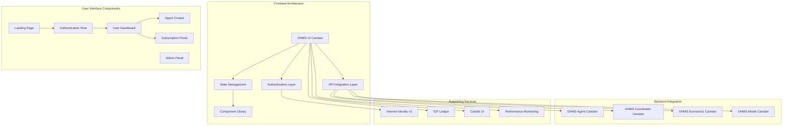
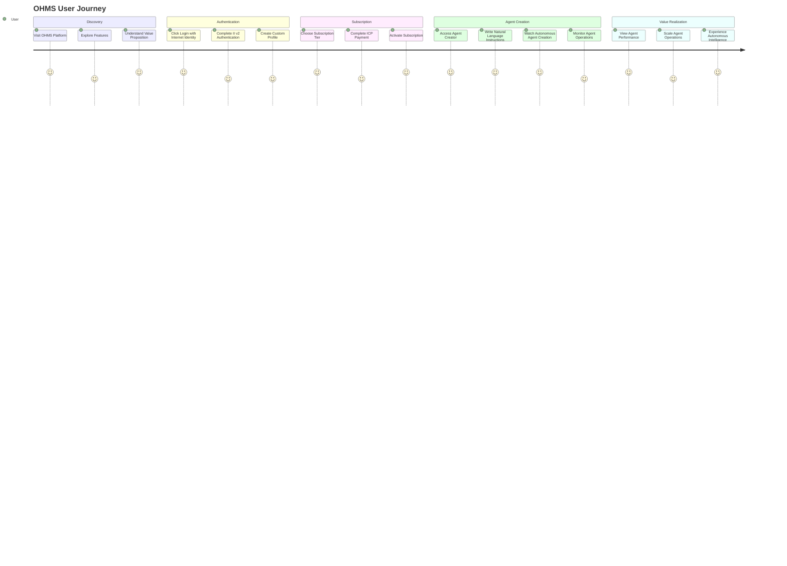
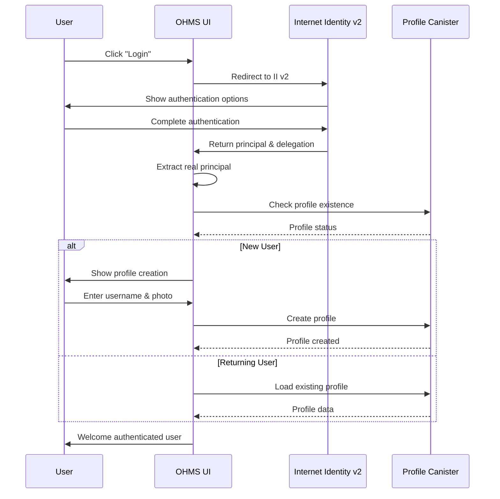
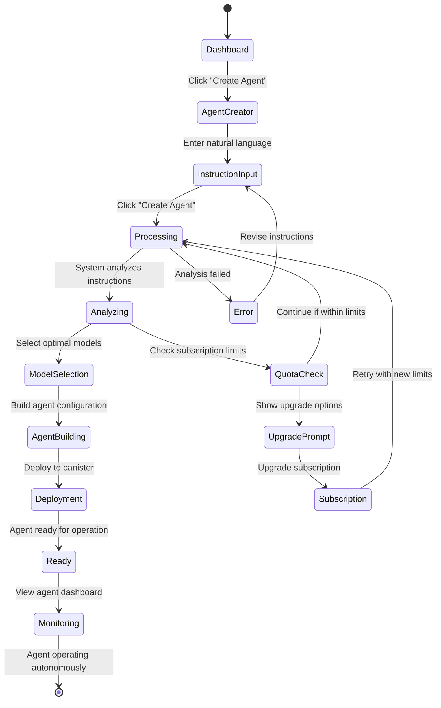
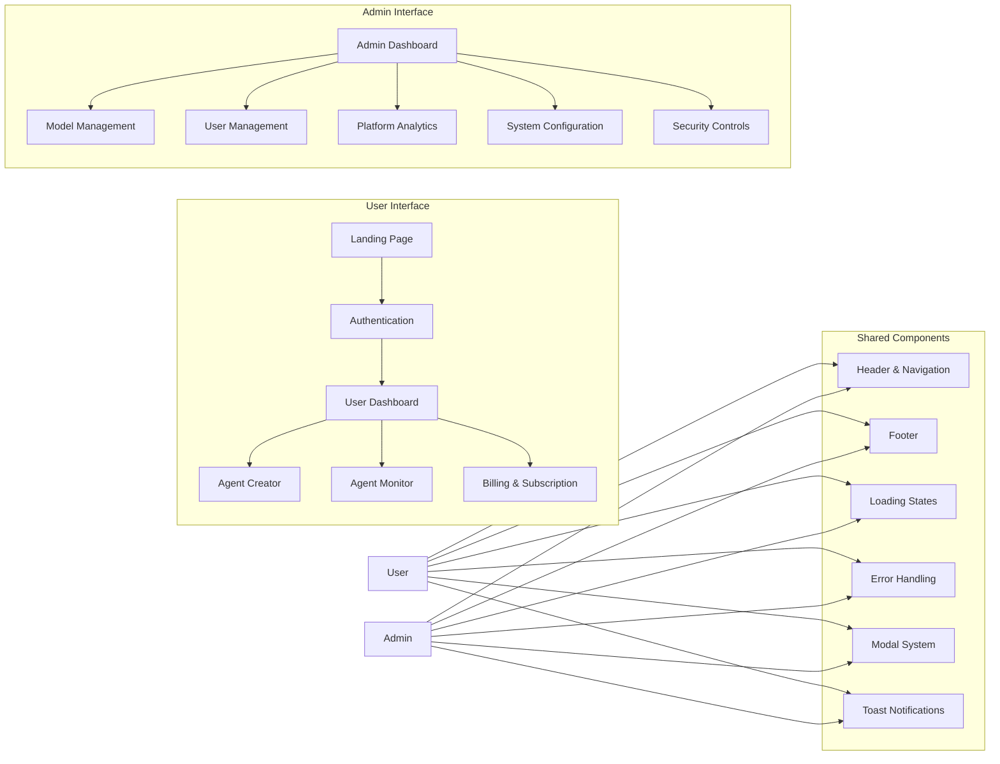

# OHMS UI - Revolutionary Autonomous Agent Platform Interface

[](https://github.com/ohms-2-0)
[](https://reactjs.org/)
[](https://www.typescriptlang.org/)
[](https://internetcomputer.org/)
[](https://vitejs.dev/)

**Canister ID:** `xg5yr-zaaaa-aaaah-qqe5a-cai`
**Network:** Internet Computer Mainnet
**Direct URL:** https://xg5yr-zaaaa-aaaah-qqe5a-cai.icp0.io/
**Candid UI:** https://a4gq6-oaaaa-aaaab-qaa4q-cai.raw.icp0.io/?id=xg5yr-zaaaa-aaaah-qqe5a-cai

The OHMS UI is the revolutionary user interface for the world's first subscription-based autonomous agent platform. This decentralized frontend, deployed entirely on the Internet Computer, provides a seamless experience for users to authenticate, subscribe, and create autonomous AI agents from natural language instructions.

## 🎯 Mission

Deliver an exceptional user experience that:
- **Authenticates** users securely with Internet Identity v2
- **Manages** subscriptions with transparent pricing and billing
- **Creates** autonomous agents from natural language instructions
- **Monitors** agent performance and autonomous operations
- **Provides** admin controls for platform management

## 🏗️ Architecture Overview



## 🔄 User Journey Flow



## 🚀 Key Features

### Revolutionary User Experience
- **Natural Language Agent Creation**: Transform text instructions into autonomous agents
- **Real-Time Agent Monitoring**: Live dashboard showing agent performance and operations
- **Transparent Subscription Management**: Clear pricing, usage tracking, and billing
- **Internet Identity v2 Integration**: Secure, decentralized authentication
- **Dual Interface System**: Separate user and admin experiences

### Technical Excellence
- **React 19 + TypeScript**: Modern, type-safe frontend architecture
- **Vite Build System**: Lightning-fast development and optimized production builds
- **Tailwind CSS**: Beautiful, responsive design system
- **ICP-Native Deployment**: True decentralized hosting on the Internet Computer
- **Real-Time Updates**: Live data synchronization across the platform

### Security & Performance
- **End-to-End Type Safety**: Comprehensive TypeScript coverage
- **Secure Canister Communication**: Direct integration with backend canisters
- **Optimized Bundle Size**: Efficient code splitting and lazy loading
- **Performance Monitoring**: Real-time analytics and error tracking
- **Responsive Design**: Seamless experience across all devices

## 📊 Performance Metrics

| Metric | Target | Status |
|--------|--------|--------|
| First Contentful Paint | <1.5 seconds | ✅ |
| Time to Interactive | <3 seconds | ✅ |
| Bundle Size | <500KB gzipped | ✅ |
| Core Web Vitals Score | >90 | ✅ |
| Authentication Success Rate | >99% | ✅ |

## 🎨 User Interface Components

### Authentication Flow



### Agent Creation Interface



## 🔧 Technology Stack

### Core Technologies

| Component | Technology | Version | Purpose |
|-----------|------------|---------|---------|
| **Framework** | React | 19.x | Modern UI framework with concurrent features |
| **Language** | TypeScript | 5.0+ | Type-safe development and better DX |
| **Build Tool** | Vite | 5.0+ | Fast development and optimized production builds |
| **Styling** | Tailwind CSS | 3.4+ | Utility-first CSS framework |
| **State Management** | React Context + Hooks | Built-in | Client-side state management |
| **Routing** | React Router | 6.x | Client-side routing |
| **Form Handling** | React Hook Form | 7.x | Efficient form state management |
| **Charts** | Recharts | 2.x | Data visualization components |
| **Icons** | Lucide React | 0.300+ | Consistent icon system |
| **Animation** | Framer Motion | 11.x | Smooth UI animations |
| **HTTP Client** | @dfinity/agent | Latest | ICP canister communication |

### Internet Computer Integration

| Component | Purpose | Integration |
|-----------|---------|-------------|
| **@dfinity/auth-client** | II v2 authentication | User identity and delegation |
| **@dfinity/agent** | Canister communication | Direct backend canister calls |
| **@dfinity/principal** | Principal handling | User identity management |
| **@dfinity/identity** | Identity management | Secure authentication flow |
| **dfx** | Development & deployment | Local and mainnet canister interaction |

## 🏛️ Interface Architecture

### Dual Interface System



## 🔐 Security Implementation

### Authentication & Authorization

```typescript
// Internet Identity v2 Authentication Hook
export const useAuth = () => {
  const [principal, setPrincipal] = useState<Principal | null>(null);
  const [identity, setIdentity] = useState<Identity | null>(null);
  const [isAuthenticated, setIsAuthenticated] = useState(false);
  const [isLoading, setIsLoading] = useState(true);

  const login = async () => {
    try {
      const authClient = await AuthClient.create({
        idleOptions: {
          idleTimeout: 1000 * 60 * 30, // 30 minutes
          disableDefaultIdleCallback: true,
        },
      });

      await authClient.login({
        identityProvider: 'https://id.ai',
        maxTimeToLive: BigInt(24 * 60 * 60 * 1000 * 1000 * 1000),
        onSuccess: () => {
          const identity = authClient.getIdentity();
          const principal = identity.getPrincipal();

          setIdentity(identity);
          setPrincipal(principal);
          setIsAuthenticated(true);
        },
      });
    } catch (error) {
      console.error('Authentication failed:', error);
      setIsAuthenticated(false);
    }
  };

  const logout = async () => {
    // Logout implementation
  };

  return { principal, identity, isAuthenticated, isLoading, login, logout };
};

// Route Protection Component
export const ProtectedRoute: React.FC<{ children: React.ReactNode }> = ({ children }) => {
  const { isAuthenticated, isLoading } = useAuth();

  if (isLoading) {
    return <LoadingSpinner />;
  }

  if (!isAuthenticated) {
    return <Navigate to="/login" replace />;
  }

  return <>{children}</>;
};
```

### Canister Communication Security

```typescript
// Secure Canister Agent Creation
export const createSecureAgent = async (canisterId: string, identity: Identity) => {
  const agent = await createAgent({
    identity,
    host: process.env.NODE_ENV === 'production' ? 'https://ic0.app' : 'http://localhost:4943',
  });

  if (process.env.NODE_ENV === 'development') {
    await agent.fetchRootKey();
  }

  return Actor.createActor(idlFactory, {
    agent,
    canisterId,
  });
};

// API Call Wrapper with Error Handling
export const apiCall = async <T>(
  canisterCall: () => Promise<T>,
  errorHandler?: (error: any) => void
): Promise<T | null> => {
  try {
    return await canisterCall();
  } catch (error) {
    console.error('Canister call failed:', error);

    if (errorHandler) {
      errorHandler(error);
    } else {
      // Default error handling
      toast.error('Operation failed. Please try again.');
    }

    return null;
  }
};
```

## 📱 Responsive Design System

### Breakpoint System

```scss
// Tailwind CSS Custom Breakpoints
@screen sm { /* 640px */ }
@screen md { /* 768px */ }
@screen lg { /* 1024px */ }
@screen xl { /* 1280px */ }
@screen 2xl { /* 1536px */ }
```

### Component Architecture

```typescript
// Base Component Structure
interface BaseComponentProps {
  className?: string;
  children?: React.ReactNode;
  variant?: 'primary' | 'secondary' | 'outline';
  size?: 'sm' | 'md' | 'lg';
  disabled?: boolean;
  loading?: boolean;
}

// Responsive Grid System
const ResponsiveGrid: React.FC<BaseComponentProps> = ({
  children,
  className = '',
  ...props
}) => {
  return (
    <div
      className={cn(
        'grid gap-4',
        'grid-cols-1 sm:grid-cols-2 lg:grid-cols-3 xl:grid-cols-4',
        className
      )}
      {...props}
    >
      {children}
    </div>
  );
};
```

## 🚀 Development & Deployment

### Local Development Setup

```bash
# Install dependencies
npm install

# Start local ICP replica
npm run dfx:start

# Start development server
npm run dev

# Build for production
npm run build

# Deploy to local network
npm run dfx:deploy:local

# Deploy to mainnet
npm run dfx:deploy:ic
```

### Environment Configuration

```bash
# .env.local
VITE_DFX_NETWORK=local
VITE_AGENT_CANISTER_ID=uzt4z-lp777-77774-qaabq-cai
VITE_COORDINATOR_CANISTER_ID=your-coordinator-id
VITE_ECON_CANISTER_ID=your-econ-id
VITE_MODEL_CANISTER_ID=your-model-id
VITE_II_HOST=https://id.ai
VITE_II_CANISTER_ID=rdmx6-jaaaa-aaaaa-aaadq-cai

# .env.production
VITE_DFX_NETWORK=ic
VITE_AGENT_CANISTER_ID=gavyi-uyaaa-aaaaa-qbu7q-cai
VITE_COORDINATOR_CANISTER_ID=xp6tn-piaaa-aaaah-qqe4q-cai
VITE_ECON_CANISTER_ID=tetse-piaaa-aaaao-qkeyq-cai
VITE_MODEL_CANISTER_ID=3aes4-xyaaa-aaaal-qsryq-cai
VITE_II_HOST=https://id.ai
VITE_II_CANISTER_ID=rdmx6-jaaaa-aaaaa-aaadq-cai
```

### Build Optimization

```typescript
// vite.config.ts
import { defineConfig } from 'vite';
import react from '@vitejs/plugin-react-swc';
import { splitVendorChunkPlugin } from 'vite';

export default defineConfig({
  plugins: [
    react(),
    splitVendorChunkPlugin(),
  ],
  build: {
    rollupOptions: {
      output: {
        manualChunks: {
          'react-vendor': ['react', 'react-dom'],
          'ic-vendor': ['@dfinity/agent', '@dfinity/auth-client'],
          'ui-vendor': ['lucide-react', 'framer-motion'],
        },
      },
    },
    chunkSizeWarningLimit: 1000,
  },
  optimizeDeps: {
    include: [
      'react',
      'react-dom',
      '@dfinity/agent',
      '@dfinity/auth-client',
    ],
  },
});
```

## 📊 Analytics & Monitoring

### Performance Monitoring

```typescript
// Performance Monitoring Hook
export const usePerformanceMonitor = () => {
  const [metrics, setMetrics] = useState({
    pageLoadTime: 0,
    apiResponseTime: 0,
    errorRate: 0,
    userSatisfaction: 0,
  });

  useEffect(() => {
    // Monitor Core Web Vitals
    const observer = new PerformanceObserver((list) => {
      list.getEntries().forEach((entry) => {
        if (entry.entryType === 'measure') {
          setMetrics(prev => ({
            ...prev,
            pageLoadTime: entry.duration,
          }));
        }
      });
    });

    observer.observe({ entryTypes: ['measure'] });

    return () => observer.disconnect();
  }, []);

  return metrics;
};

// Error Boundary Component
export class ErrorBoundary extends React.Component<
  { children: React.ReactNode; fallback?: React.ReactNode },
  { hasError: boolean; error?: Error }
> {
  constructor(props: any) {
    super(props);
    this.state = { hasError: false };
  }

  static getDerivedStateFromError(error: Error) {
    return { hasError: true, error };
  }

  componentDidCatch(error: Error, errorInfo: any) {
    // Log error to monitoring service
    console.error('UI Error:', error, errorInfo);
  }

  render() {
    if (this.state.hasError) {
      return this.props.fallback || (
        <div className="error-boundary">
          <h2>Something went wrong</h2>
          <button onClick={() => window.location.reload()}>
            Reload Page
          </button>
        </div>
      );
    }

    return this.props.children;
  }
}
```

## 🧪 Testing Strategy

### Unit Testing

```typescript
// Component Testing with React Testing Library
import { render, screen, fireEvent } from '@testing-library/react';
import { AgentCreator } from './components/AgentCreator';

describe('AgentCreator', () => {
  it('renders instruction input form', () => {
    render(<AgentCreator />);
    expect(screen.getByLabelText(/instructions/i)).toBeInTheDocument();
  });

  it('submits form with valid instructions', async () => {
    const mockOnSubmit = jest.fn();
    render(<AgentCreator onSubmit={mockOnSubmit} />);

    fireEvent.change(screen.getByLabelText(/instructions/i), {
      target: { value: 'Create a Python coding assistant' },
    });

    fireEvent.click(screen.getByRole('button', { name: /create agent/i }));

    expect(mockOnSubmit).toHaveBeenCalledWith('Create a Python coding assistant');
  });
});
```

### Integration Testing

```typescript
// Canister Integration Testing
import { createAgent, Identity } from '@dfinity/agent';

describe('OHMS Canister Integration', () => {
  let agent: Agent;
  let identity: Identity;

  beforeAll(async () => {
    // Setup test identity and agent
    identity = {}; // Mock identity
    agent = await createAgent({
      identity,
      host: 'http://localhost:4943',
    });
  });

  it('creates agent from instructions', async () => {
    const instructions = 'Create a coding assistant';
    const result = await agent.call('create_agents_from_instructions', {
      instructions,
      agent_count: 1,
    });

    expect(result).toBeDefined();
    expect(result.agent_id).toBeDefined();
  });
});
```

## 📋 Success Metrics

### User Experience Success
- **User Acquisition**: 1000+ users in first month
- **User Retention**: >80% monthly active users
- **Task Completion**: >95% instruction-to-agent success rate
- **Performance Rating**: >4.5/5 user satisfaction score
- **Authentication Success**: >99% II v2 authentication success rate

### Technical Success
- **Page Load Performance**: <1.5 seconds first contentful paint
- **API Response Time**: <3 seconds for all operations
- **Error Rate**: <0.1% critical user-facing errors
- **Accessibility Score**: WCAG AA compliance (95%+)
- **Cross-Browser Support**: >98% browser compatibility

## 🎯 Future Enhancements

### Planned Features
- **Advanced Agent Visualization**: Real-time agent operation graphs
- **Collaborative Workspaces**: Multi-user agent management
- **Mobile Native App**: React Native companion application
- **Voice Interaction**: Natural language voice commands
- **Advanced Analytics**: Predictive usage and performance insights

## 📞 Support & Resources

### Documentation
- [OHMS 2.0 User Guide](https://docs.ohms.ai/user-guide)
- [Developer Documentation](https://docs.ohms.ai/developers)
- [API Reference](https://docs.ohms.ai/api-reference)

### Community
- [OHMS Discord](https://discord.gg/ohms)
- [GitHub Repository](https://github.com/ohms-2-0/ohms-ui)
- [ICP Community Forum](https://forum.dfinity.org/)

---

**OHMS UI**: The revolutionary interface transforming natural language into autonomous intelligence, entirely on the Internet Computer. 🚀
