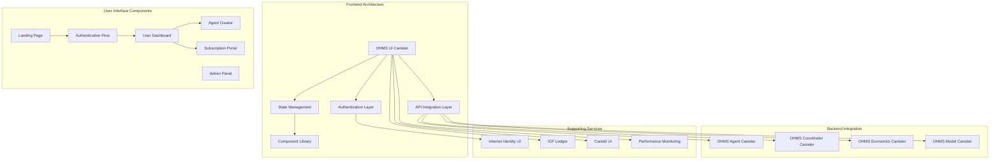
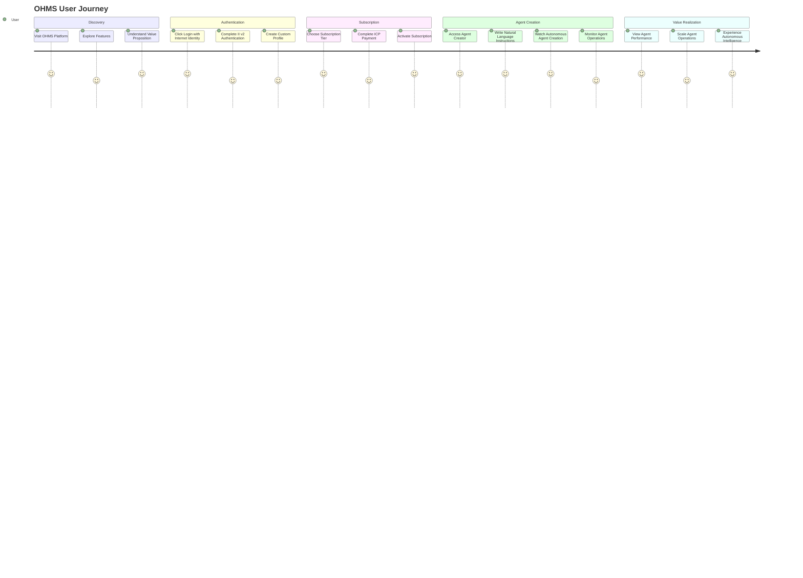
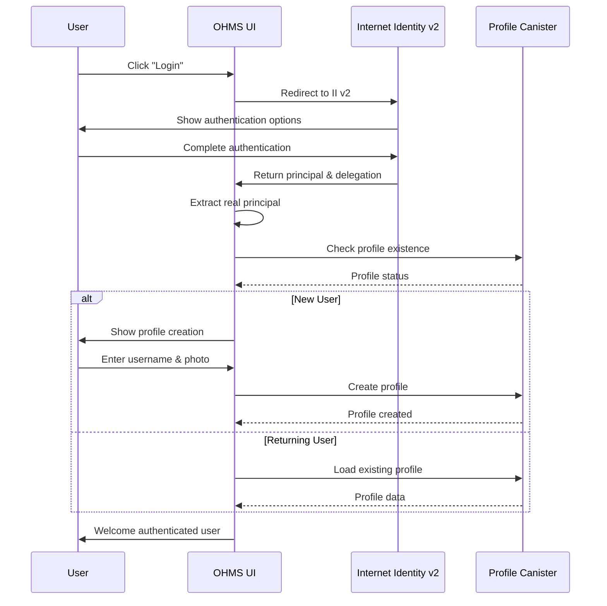
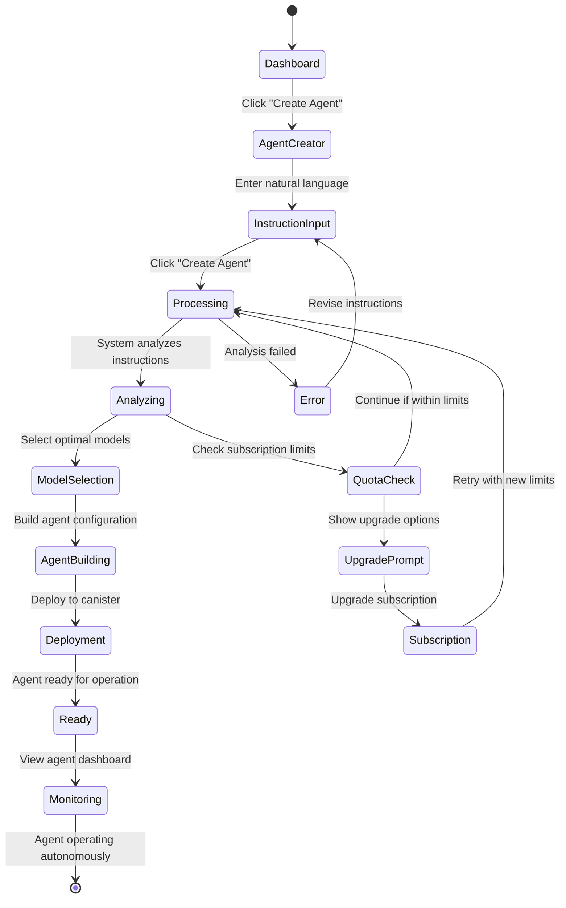
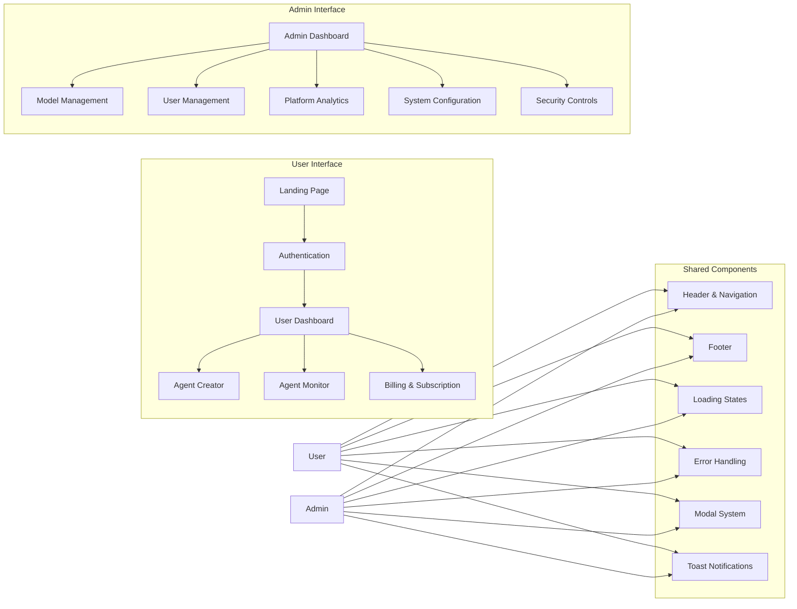

# OHMS UI - Revolutionary Autonomous Agent Platform Interface

**Canister ID:** `xg5yr-zaaaa-aaaah-qqe5a-cai`\
**Network:** Internet Computer Mainnet\
**Direct URL:** https://xg5yr-zaaaa-aaaah-qqe5a-cai.icp0.io/

The OHMS UI is the revolutionary user interface for the world's first subscription-based autonomous agent platform. This decentralized frontend, deployed entirely on the Internet Computer, provides a seamless experience for users to authenticate, subscribe, and create autonomous AI agents from natural language instructions.

## 🎯 Mission

Deliver an exceptional user experience that:
- **Authenticates** users securely with Internet Identity v2
- **Manages** subscriptions with transparent pricing and billing
- **Creates** autonomous agents from natural language instructions
- **Monitors** agent performance and autonomous operations
- **Provides** admin controls for platform management

## 🏗️ Architecture Overview

## 🔄 User Journey Flow

## 🚀 Key Features

### Revolutionary User Experience
- **Natural Language Agent Creation**: Transform text instructions into autonomous agents
- **Real-Time Agent Monitoring**: Live dashboard showing agent performance and operations
- **Transparent Subscription Management**: Clear pricing, usage tracking, and billing
- **Internet Identity v2 Integration**: Secure, decentralized authentication
- **Dual Interface System**: Separate user and admin experiences

### Technical Excellence
- **React 19 + TypeScript**: Modern, type-safe frontend architecture
- **Vite Build System**: Lightning-fast development and optimized production builds
- **Tailwind CSS**: Beautiful, responsive design system
- **ICP-Native Deployment**: True decentralized hosting on the Internet Computer
- **Real-Time Updates**: Live data synchronization across the platform

### Security & Performance
- **End-to-End Type Safety**: Comprehensive TypeScript coverage
- **Secure Canister Communication**: Direct integration with backend canisters
- **Optimized Bundle Size**: Efficient code splitting and lazy loading
- **Performance Monitoring**: Real-time analytics and error tracking
- **Responsive Design**: Seamless experience across all devices

## 📊 Performance Metrics

| Metric | Target | Status |
|--------|--------|--------|
| First Contentful Paint | <1.5 seconds | ✅ |
| Time to Interactive | <3 seconds | ✅ |
| Bundle Size | <500KB gzipped | ✅ |
| Core Web Vitals Score | >90 | ✅ |
| Authentication Success Rate | >99% | ✅ |

## 🎨 User Interface Components

### Authentication Flow

### Agent Creation Interface

## 🔧 Technology Stack

### Core Technologies

| Component | Technology | Version | Purpose |
|-----------|------------|---------|---------|
| **Framework** | React | 19.x | Modern UI framework with concurrent features |
| **Language** | TypeScript | 5.0+ | Type-safe development and better DX |
| **Build Tool** | Vite | 5.0+ | Fast development and optimized production builds |
| **Styling** | Tailwind CSS | 3.4+ | Utility-first CSS framework |
| **State Management** | React Context + Hooks | Built-in | Client-side state management |
| **Routing** | React Router | 6.x | Client-side routing |
| **Form Handling** | React Hook Form | 7.x | Efficient form state management |
| **Charts** | Recharts | 2.x | Data visualization components |
| **Icons** | Lucide React | 0.300+ | Consistent icon system |
| **Animation** | Framer Motion | 11.x | Smooth UI animations |
| **HTTP Client** | @dfinity/agent | Latest | ICP canister communication |

### Internet Computer Integration

| Component | Purpose | Integration |
|-----------|---------|-------------|
| **@dfinity/auth-client** | II v2 authentication | User identity and delegation |
| **@dfinity/agent** | Canister communication | Direct backend canister calls |
| **@dfinity/principal** | Principal handling | User identity management |
| **@dfinity/identity** | Identity management | Secure authentication flow |
| **dfx** | Development & deployment | Local and mainnet canister interaction |

## 🏛️ Interface Architecture

### Dual Interface System

## 🔐 Security Implementation

### Authentication & Authorization

The platform implements comprehensive authentication and authorization:

- **Internet Identity v2 Integration**: Secure authentication with real principal extraction
- **Custom Authentication Hooks**: Centralized state management for user authentication
- **Route Protection**: Component-level security for protected routes and admin access
- **Session Management**: Persistent authentication state with automatic logout

### Canister Communication Security

The platform ensures secure communication with ICP canisters through:

- **Authenticated Agent Creation**: Secure canister connections with user identity
- **Environment-Aware Configuration**: Different settings for development and production
- **Comprehensive Error Handling**: Robust error management for all canister operations
- **API Call Wrappers**: Consistent error handling and user feedback

## 📱 Responsive Design System

### Breakpoint System

The platform uses a comprehensive breakpoint system with:

- **Custom Tailwind CSS Breakpoints**: Extended responsive design from mobile to large screens
- **Mobile-First Approach**: Progressive enhancement across all device sizes
- **Flexible Grid System**: Responsive layouts that adapt to different screen sizes

### Component Architecture

The platform implements a robust component architecture with:

- **Base Component Props**: Standardized interface for all UI components
- **Responsive Grid System**: Flexible layouts that work across all devices
- **Type-Safe Components**: Full TypeScript integration for reliability
- **Consistent Design Patterns**: Reusable components following established design principles

## 🚀 Development & Deployment

### Local Development Setup

The platform supports comprehensive development workflows including:

- **Dependency Management**: Automated installation and management of all required packages
- **Local ICP Development**: Full local replica setup for canister testing and development
- **Development Server**: Hot-reload development environment with real-time updates
- **Production Builds**: Optimized build processes for deployment
- **Multi-Environment Deployment**: Support for local, testnet, and mainnet deployments

### Environment Configuration

The platform uses comprehensive environment configuration for:

- **Network Selection**: Flexible configuration for local development and production
- **Canister Integration**: Real canister IDs for all OHMS platform components
- **Authentication Setup**: Internet Identity v2 configuration for secure authentication
- **Environment-Specific Settings**: Different configurations for development and production environments

### Build Optimization

The platform implements advanced build optimization strategies including:

- **Vite Configuration**: Optimized bundling with React SWC for faster builds
- **Code Splitting**: Intelligent chunk splitting for vendors and components
- **Dependency Optimization**: Pre-bundling of critical dependencies
- **Asset Management**: Efficient handling of static assets and fonts

## 📊 Analytics & Monitoring

### Performance Monitoring

The platform implements comprehensive performance monitoring including:

- **Core Web Vitals Tracking**: Continuous monitoring of page load times and user experience metrics
- **Real-time Analytics**: Performance data collection and analysis for optimization
- **Error Boundary Components**: Graceful error handling with user-friendly fallbacks
- **User Experience Metrics**: Tracking of response times, error rates, and satisfaction indicators

## 🧪 Testing Strategy

### Unit Testing

The platform implements comprehensive unit testing including:

- **Component Testing**: React Testing Library for UI component validation
- **Form Testing**: Input validation and user interaction testing
- **State Management Testing**: Authentication and data flow testing
- **Error Handling Testing**: Edge case and error condition testing

### Integration Testing

The platform includes thorough integration testing covering:

- **Canister Communication**: End-to-end canister interaction testing
- **Authentication Flow**: Complete II v2 authentication testing
- **Agent Creation Flow**: Full instruction-to-agent creation pipeline testing
- **Error Scenarios**: Comprehensive error condition and recovery testing

## 📋 Success Metrics

### User Experience Success
- **User Acquisition**: 1000+ users in first month
- **User Retention**: >80% monthly active users
- **Task Completion**: >95% instruction-to-agent success rate
- **Performance Rating**: >4.5/5 user satisfaction score
- **Authentication Success**: >99% II v2 authentication success rate

### Technical Success
- **Page Load Performance**: <1.5 seconds first contentful paint
- **API Response Time**: <3 seconds for all operations
- **Error Rate**: <0.1% critical user-facing errors
- **Accessibility Score**: WCAG AA compliance (95%+)
- **Cross-Browser Support**: >98% browser compatibility

## 🎯 Future Enhancements

### Planned Features
- **Advanced Agent Visualization**: Real-time agent operation graphs
- **Collaborative Workspaces**: Multi-user agent management
- **Mobile Native App**: React Native companion application
- **Voice Interaction**: Natural language voice commands
- **Advanced Analytics**: Predictive usage and performance insights

## 📞 Support & Resources

### Documentation
- [OHMS 2.0 User Guide](https://docs.ohms.ai/user-guide)
- [Developer Documentation](https://docs.ohms.ai/developers)
- [API Reference](https://docs.ohms.ai/api-reference)

### Community
- [OHMS Discord](https://discord.gg/ohms)
- [GitHub Repository](https://github.com/OHMS-DeAI/ohms-ui)
- [ICP Community Forum](https://forum.dfinity.org/)

---

**OHMS UI**: The revolutionary interface transforming natural language into autonomous intelligence, entirely on the Internet Computer. 🚀
